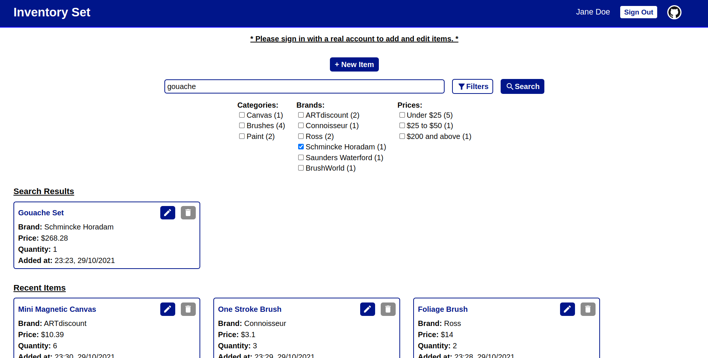

# Inventory Set

Inventory Set is an inventory management system which provides stock control and item tracking. This application has a fully responsive React frontend while the backend consists of a MVC based Node.js + Express.js REST API and a MongoDB database. The user authentication and authorization implementations use JWT.

